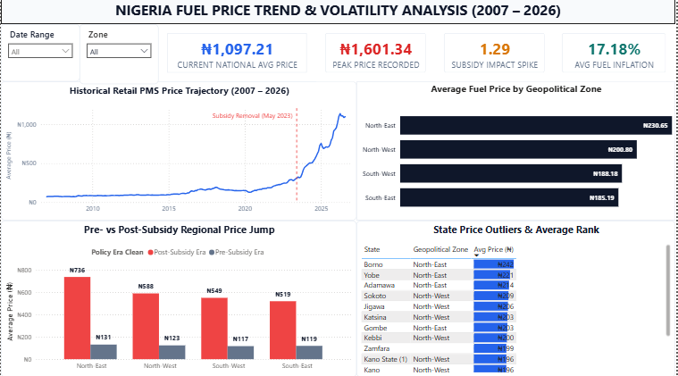
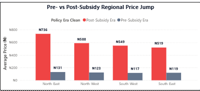

# Nigeria Fuel Price Trend & Volatility Analysis

## Project Overview

This project analyses Nigeria's Premium Motor Spirit (PMS) retail price data from 2007 to 2026 to understand how fuel prices have changed over time and how pricing differs across states and geopolitical zones.

Particular attention is given to the significant price shift following the removal of the fuel subsidy in May 2023.

The project was developed as part of the **Data Science NextGen Cohort** using Microsoft Excel, Power Query, Power BI, and DAX.

---

## Fellow Information

**Fellow:** Joseph Eduoku  
**Fellow ID:** FE/26/72213414  
**Track:** Data Science NextGen Cohort  
**ALC:** Guru Innovation Hub, Cross River State

---

## Project Objectives

The project aims to:

- Analyse historical fuel-price trends in Nigeria.
- Examine changes in petrol prices over time.
- Identify the impact of major price changes, particularly after May 2023.
- Compare fuel prices across geopolitical zones.
- Identify differences in state-level fuel prices.
- Examine fuel-price volatility and regional disparities.
- Provide data-driven insights that can support fuel distribution and pricing decisions.

---

## Dataset Overview

The analysis covers Nigeria's Premium Motor Spirit (PMS) retail price data from **2007 to 2026**.

The data was prepared and transformed using Microsoft Excel and Power Query before being analysed and visualized using Power BI and DAX.

The raw dataset is not included in this repository.

---

## Tools Used

| Tool | Purpose |
|---|---|
| Microsoft Excel | Data inspection and preparation |
| Power Query | Data cleaning and transformation |
| Microsoft Power BI | Dashboard development and visualization |
| DAX | Measures, KPIs, and analytical calculations |

---

## Key Findings

| Indicator | Result |
|---|---:|
| Current National Average | ₦1,097.21/L |
| Highest Recorded Price | ₦1,601.34/L |
| Average Historical YoY Change | 17.18% |
| Subsidy-Removal Price Impact | 1.29× |

The analysis shows a major change in Nigeria's fuel-price pattern after the removal of the fuel subsidy in May 2023.

Before the subsidy removal, petrol prices generally remained below ₦250 per litre for much of the historical period. Following the policy change, prices increased substantially, reaching more than ₦1,000 per litre in the later period of the dataset.

---

## Regional Price Differences

Fuel-price increases were not uniform across Nigeria.

The **North-East** recorded a post-subsidy average of approximately **₦736/L**, compared with about **₦131/L** before the subsidy removal.

The **North-West** recorded approximately **₦588/L**, compared with about **₦123/L** before the policy change.

The **South-West** and **South-East** recorded post-subsidy averages of approximately **₦549/L** and **₦519/L**, respectively.

These differences indicate that location, transportation costs, supply routes, and access to major fuel distribution points can influence retail fuel prices.

---

## State-Level Insights

The historical analysis identified several states with relatively high long-term average prices, including:

- Borno — approximately ₦243/L
- Yobe — approximately ₦222/L
- Adamawa — approximately ₦214/L
- Sokoto — approximately ₦210/L

These differences highlight the potential effect of distribution distance, transportation costs, and regional supply conditions on fuel prices.

---

## Dashboard Preview

### Fuel Price Overview



### Regional Fuel Price Analysis



---

## Key Analytical Areas

The Power BI dashboard examines:

- Historical fuel-price trends
- National average price movement
- Year-on-year price changes
- Month-on-month price changes
- Regional price differences
- State-level price patterns
- Pre- and post-subsidy price changes
- Fuel-price volatility

---

## Recommendations

### 1. Improve Fuel Distribution Infrastructure

Strengthen transportation and distribution networks to help reduce regional price differences.

### 2. Develop Regional Storage Capacity

Strategic fuel storage facilities can help reduce the impact of supply disruptions and regional shortages.

### 3. Expand Alternative Energy Options

Investment in CNG and other alternative energy solutions can provide additional options for transportation and energy users.

### 4. Monitor Regional Price Disparities

Data-driven monitoring systems can help identify unusual price movements and support timely policy responses.

---

## Project Impact

This project demonstrates how data analytics can be used to understand changes in Nigeria's fuel-price landscape.

It combines historical data analysis, data transformation, Power BI visualization, and DAX calculations to provide insights into fuel-price trends, regional differences, and price changes following major policy shifts.

---

## Project Deliverables

### Executive Insight Summary

[View Executive Insight Summary](<Executive Insight Summary_ Nigeria Fuel Price Trend & Volatility Analysis (2007 – 2026) (1).pdf>)

### Power BI Dashboard

[View Power BI Dashboard](<Nigeria Fuel Price Trend & Volatility Analysis (2007 – 2026).pbix>)

---

## Project Files

```text
Nigeria Fuel Price Trend & Volatility Analysis/
│
├── README.md
├── Fuel_Price_Overview.png
├── Fuel_Price_Regional_Analysis.png
├── Executive Insight Summary_ Nigeria Fuel Price Trend & Volatility Analysis (2007 – 2026) (1).pdf
└── Nigeria Fuel Price Trend & Volatility Analysis (2007 – 2026).pbix
